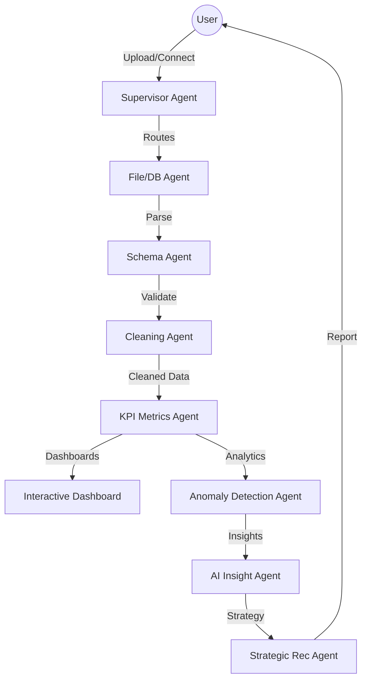

# 🤖 Multi-Agent AI Data Platform
### Universal Data Cleaning, KPI Intelligence & Business Analytics

[](https://www.python.org/)
[](https://streamlit.io/)
[](https://groq.com/)
[](https://opensource.org/licenses/MIT)

A high-performance, production-grade AI platform that leverages a **Multi-Agent Architecture** to automate the entire data lifecycle—from messy ingestion to strategic business recommendations.

---

## 📑 Table of Contents
- [Project Overview](#-project-overview)
- [System Architecture](#-system-architecture)
- [Core Features](#-core-features)
- [Tech Stack](#-tech-stack)
- [Installation & Setup](#-installation--setup)
- [Agent Workflow](#-agent-workflow)
- [Supported Data Sources](#-supported-data-sources)
- [Author](#-author)

---

## 🌟 Project Overview
The **Multi-Agent AI Data Platform** is designed for data analysts and business leaders who need instant insights without writing complex code. By utilizing specialized LLM-powered agents, the system understands your data, cleans it, detects anomalies, and generates interactive dashboards automatically.

---

## 🏗 System Architecture



---

## ✨ Core Features

### 🧹 Automated Data Cleaning
- **Intelligent Deduplication**: Detects and removes redundant entries.
- **Smart Imputation**: Fills missing values using mean/mode or AI-driven context.
- **Format Standardization**: Normalizes dates, currency, and text casing automatically.

### 📊 KPI Intelligence Engine
- **Auto-Detection**: Identifies Sales, Finance, HR, and Marketing metrics without manual configuration.
- **Dynamic Visuals**: Generates Plotly-based trend lines, histograms, and heatmaps.

### 💬 AI Natural Language Query (NLQ)
- Talk to your data. Convert questions like *"What was the highest margin product in Q3?"* into optimized SQL queries instantly.

### 🕵️ Anomaly & Fraud Detection
- Leverages **Isolation Forest** and **Z-Score** statistics to flag suspicious patterns and outliers.

---

## 🛠 Tech Stack

| Category | Technology |
| :--- | :--- |
| **Frontend** | Streamlit (Custom Dark Theme) |
| **Intelligence** | Groq API (Llama 3.3 70B & 3.1 8B) |
| **Processing** | Pandas, NumPy, Scikit-learn |
| **Visualization** | Plotly, Matplotlib |
| **Database** | SQLite (Local), MySQL (Remote Connector) |
| **DevOps** | Git, Python-Dotenv |

---

## 🚀 Installation & Setup

### 1. Clone the Repository
```bash
git clone https://github.com/bittush8789/AI-Data-Platform.git
cd AI-Data-Platform
```

### 2. Create Virtual Environment
```bash
python -m venv venv
source venv/bin/activate  # On Windows: venv\Scripts\activate
```

### 3. Install Dependencies
```bash
pip install -r requirements.txt
```

### 4. Environment Configuration
Create a `.env` file in the root directory:
```env
GROQ_API_KEY=your_actual_groq_api_key
DATABASE_URL=sqlite:///database/app_data.db
```

### 5. Run the Platform
```bash
streamlit run app.py
```

---

## 🤖 Agent Workflow
1. **Supervisor Agent**: The entry point that understands user intent and routes tasks.
2. **Schema Agent**: Analyzes data types and relationships to build a semantic map.
3. **Cleaning Agent**: Executes multi-step transformation pipelines.
4. **Insight Agent**: Explains "The Why" behind the data trends.
5. **Recommendation Agent**: Converts insights into actionable business steps.

---

## 📂 Supported Data Sources
- **Flat Files**: CSV, Excel (.xlsx, .xls)
- **Semi-Structured**: JSON (with automatic flattening)
- **Database Dumps**: SQL Scripts (.sql)
- **Live Databases**: MySQL, SQLite
- **Infrastructure**: Nginx/Apache Server Logs

---

## 👤 Author
**Bittu Sharma**
- GitHub: [@bittush8789](https://github.com/bittush8789)
- LinkedIn: [Bittu Sharma](https://www.linkedin.com/in/bittu-sharma-6a75752b5/)

---

## 📄 License
This project is licensed under the MIT License - see the [LICENSE](LICENSE) file for details.
